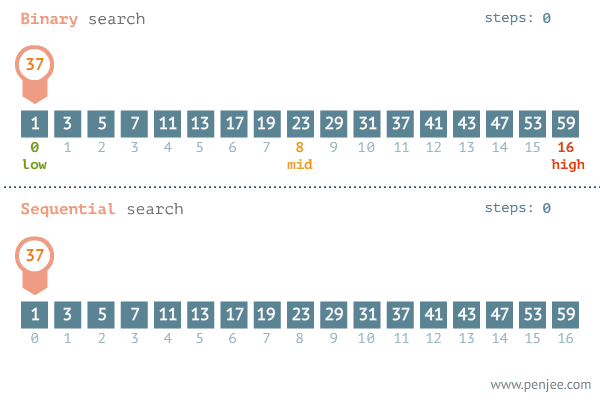

# Esercizio 5: Ricerca Binaria 🏍

Scrivete un programma ricorsivo che implementi l'algoritmo della [ricerca binaria](https://it.wikipedia.org/wiki/Ricerca_dicotomica)
per la ricerca di un elemento all'interno di un array ordinato di interi

