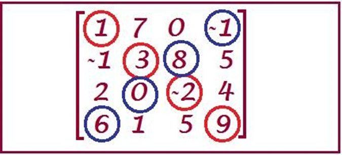

## Esercizio 9: Somma Diagonale 🛵

* Scrivete una funzione che data una matrice quadrata in input, restituisce la somma diagonale da sinistra a destra.
* Scrivete una seconda funzione che presa una matrice quadrata e un booleano a seconda del valore del booleano restituisce la somma della diagonale da sinistra a destra o quella da destra a sinistra.

**Suggerimento**: usate la prima funzione nella seconda!

